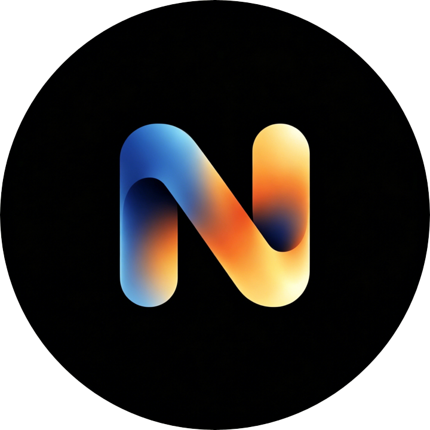

[中文](README.md) | [English](README_en.md)

<div align="center">



# NeoWarp

**A full-featured Scratch editor based on [TurboWarp Desktop](https://github.com/TurboWarp/desktop)**

While keeping TurboWarp's high-performance compiler and extension ecosystem, NeoWarp adds an AI programming assistant, multiplayer collaboration, mobile programming, a full suite of productivity tools, and a much more modern look.


</div>

---

## 📖 Introduction

**NeoWarp** is an offline Scratch 3 editor built with Electron, based on [TurboWarp/desktop](https://github.com/TurboWarp/desktop).
It fully inherits TurboWarp's core capabilities — the JS / Wasm compiler, hundreds of extensions, the Addon system, the Packager, dark mode, and more — and builds on top of them with major enhancements for **AI-assisted creation**, **multiplayer collaboration**, **workflow**, and **visual experience**.

Great for:

- Users who need to write and run Scratch projects offline
- Creators who want AI assistance for writing and modifying block scripts
- Small teams and classrooms that need multi-device, multi-person co-creation
- Users who want a more polished editor look and interaction

---

## ✨ Feature Overview

### 🤖 AI Assistant (NeoWarp AI)

An AI programming assistant deeply integrated with the editor through a dedicated window:

- **44 built-in tools**: read the project structure, add / remove / modify block scripts, manage costumes / sounds / variables / lists, install and hot-load custom extensions, click the green flag, take stage screenshots, search the web, and more
- **Custom block DSL**: the AI describes block scripts as `opcode argument` text, which is validated against the editor's opcode schema before being applied — supporting incremental add, insert, input modification and deletion, so changes land on exactly the right blocks
- **One-click undo of AI changes**: a project snapshot is captured automatically before each modification, so you can always restore the pre-chat state
- **Multimodal support**: send stage screenshots so the model can "see" how the project runs; attach images and `.md` / `.txt` / `.pdf` / `.csv` files
- **Built-in web search**: aggregated from DuckDuckGo / Bing / Wikipedia
- **Add assets from URL**: add costumes and sprites directly from an image URL
- **Todo integration**: complex tasks are automatically broken into step cards whose progress updates in real time
- Multi-conversation management, reasoning display, streaming output, one-click "Apply" for JSON blocks, usage statistics, and a thinking-effort slider

### 🎤 NeoWarp SOLO

A "pure AI" workspace with no traditional editor UI:

- Give AI instructions directly on a `.sb3` or JavaScript extension project; a hidden editor in the background provides the VM and tool support
- A standalone stage popup with green flag / pause / stop controls, variable monitors, and the project's "ask and wait" prompt box
- Changes are saved straight back to the original file

### 🤝 Collaboration

- **Host / Join**: one side opens a room (default port 8080, room password required); other devices join by address, or **automatically discover** rooms on the same LAN
- **Permission control**: the host configures guest permissions such as "add extensions / delete extensions / delete sprites"
- **Live chat**: a built-in iOS-style chat area, so you can communicate without leaving the editor
- **Real-time project sync**: changes from any participant sync to everyone instantly
- **Stable connection**: SHA-256 password check, heartbeat detection, auth timeouts, and oversize-frame protection

### 📱 Mobile Programming

- **Connect by QR code**: the AI assistant generates a QR code; scan it and your phone's browser gets **exactly the same** AI chat interface as the desktop
- **Desktop as the single source of truth**: conversations, streaming output and command execution on the phone sync to the desktop editor in real time — send block commands to your project without leaving the couch
- **Mobile preview**: the current project is served over LAN (default port 8601) as a standalone player; scan the code to try it on your phone

### 🏠 Home

The app's landing page and launcher:

- Quick actions: NeoWarp SOLO, new project / new extension, open file, image editor, host / join collaboration
- Recent projects list and a time-of-day greeting
- Customizable home logo, text and background image (in Desktop Settings)

### 🧩 Extension Editor

A built-in IDE for extension developers:

- Multi-tab JavaScript editor based on **Monaco** (the VS Code kernel), with a NeoWarp extension template
- One-click "Add to Project" (injects into any open editor window) or save to the "My Extensions" library
- A dockable **AI panel** that can pop out, helping you write and debug TurboWarp extensions

### 🖼 Image Editor

A standalone image editing window: shape drawing, cropping, rotation and flips, layer management, brightness / contrast / hue / saturation adjustments and filter presets — plus exclusive **frosted-glass / liquid-glass** shape effects (SVG displacement filters).

### 🧰 Productivity Tool Windows

- **Todo List**: lightweight todos with OS notification reminders
- **Project Analysis**: a donut chart of block-category usage, complexity / code-quality / health scores, exportable as an image
- **Task Manager**: live system CPU / memory graphs plus a per-sprite CPU usage ranking
- **Detached Stage**: pop the stage out into its own window (2x scaling, input forwarded) for dual-screen demos and debugging
- **Data Preview**: preview `data:` URLs produced by running projects in a small popup window

### 🎨 Editor Visuals & Personalization (deep customizations over upstream)

- **Adjustable block corner radius**, applied live at runtime; round extension checkboxes
- **Custom background images for the code area and the stage area**
- **"Unlimited canvas drawing"** option (removes the paint editor's canvas size limit)
- **Pinning** and right-click context menus in asset libraries
- **Add sprites / costumes from URL** (local paths supported, full-width punctuation auto-corrected, format detected by magic bytes)
- Paint editor enhancements: **smart alignment guides**, new shape tools (arrow, double arrow, heart, trapezoid, triangle), and an adjustable rounded-rectangle corner radius & curvature
- A full **"liquid glass" UI**: the Home, AI Assistant, Todo List, Task Manager and other windows use frosted-glass surfaces with transition animations

### 🧠 AI Model Support

- **Built-in free models** (no API key needed): DeepSeek V4.1 Flash, GLM-5.3 Flash, SenseNova 6.8 Flash Lite, GLM-5.2 (free promotion ends 2026-11-30)
- Supports **OpenAI / Anthropic / Ollama / custom** API formats, with presets for DeepSeek, Zhipu GLM, Kimi, Xiaomi MiMo, Huawei Pangu, Qwen, SenseNova and more
- API keys are stored only in the local `tw_config.json`; AI requests are proxied through the main process and never touch a third-party server
- The AI Assistant / SOLO / Extension Editor **share one model configuration**, managed centrally in Desktop Settings

### 🧱 Compatibility & Ecosystem

- Everything from TurboWarp is preserved: the **JS / Wasm compiler**, dark mode, the **Addon system**, the **Packager** (bundled offline; packages projects to HTML / ZIP / EXE and more), and all official extensions
- Extension documentation, asset libraries and the packager are all **localized offline**
- **NeoWarp Expands local extension library**: custom extensions placed in the `Expands/` directory are served via the `nw-expands://` protocol and appear under the "NeoWarp" tab of the extension library (a Punycode conversion extension is included as an example)

### 🖥 Desktop Integration

- Daily update check (GitHub Releases, can be disabled); the update dialog includes release notes
- **Discord Rich Presence**: show the current project name and session time in Discord
- Recent projects (one click to reopen from Home)
- Desktop Settings: light / dark / system theme, camera & microphone selection, hardware acceleration, background throttling, CORS bypass, spellchecker, and more

---

## 📁 File Formats

Natively opens / associates with the following formats:

| Extension | Description |
| --- | --- |
| `.np1` | NeoWarp Project (uncompressed, **default save format**) |
| `.npnp` | NeoWarp Encrypted Project (AES-256-GCM + PBKDF2 password encryption) |
| `.viewsb3` | NeoWarp View-only Project (for sharing and showcase) |
| `.sb3` | Scratch 3 Project |
| `.sb2` | Scratch 2 Project |
| `.sb` | Scratch 1 Project |
| `.js` | NeoWarp Extension (opened by the Extension Editor) |

> `.viewsb3` is currently only supported in the app's open dialogs; it is not registered as a system-level file association.

---

## 🏗 Architecture & Security

- The editor, Home, AI Assistant, Collaboration, SOLO and **20+ other windows** are all loaded through `tw-*` custom protocols, decoupled from the main process; the local asset library (`tw-library`) and extension gallery (`tw-extensions`) are bundled Brotli-compressed and work offline
- The **Electron sandbox** is enabled process-wide, webviews are disabled, and sensitive permissions (clipboard / notifications, etc.) are approved per window
- AI requests are proxied through the main process (`tw-ai-proxy`, bypassing CORS); keys never leave the machine

---

## 🚀 Download & Installation

Please visit the project's [Releases](https://github.com/Shiyuan-318/NeoWarp/releases) page to download the package matching your system:

| Platform | Package |
| --- | --- |
| **Windows** | `NeoWarp-Setup-x.y.z-x64.exe` (NSIS installer) / `NeoWarp Portable x.y.z x64.exe` (portable, unzip and run) |
| **macOS** | `NeoWarp-Setup-x.y.z.dmg` (Universal, dark mode supported) |
| **Linux** | `NeoWarp-linux-x64-x.y.z.deb` / `.AppImage` / `.tar.gz` |

> Since this project is a personal secondary-development work, its release channels and signing policy may differ from upstream TurboWarp — please refer to the actual published Releases.

---

## 🧑‍💻 Building from Source

```bash
git clone --recursive https://github.com/Shiyuan-318/NeoWarp.git
cd NeoWarp
npm install              # Install dependencies (runs patch-package automatically)
npm run fetch            # Download asset libraries, the packager and extension resources
npm run webpack:compile  # Compile the renderer (use webpack:watch during development)
npm run electron:start   # Start the editor
npm run electron:build   # Package installers
```

> Node.js and npm are required. `docs/screenshots` is a git submodule — if you cloned without `--recursive`, run `git submodule update --init` afterwards.

AI assistant toolchain scripts:

| Command | Description |
| --- | --- |
| `npm run ai:schema` | Generate the block opcode schema from scratch-blocks and write it into the editor |
| `npm run ai:prompt` | Build and write the AI system prompt |
| `npm run ai:check` | Verify the schema and system prompt are up to date |
| `npm run ai:test` | Run the DSL round-trip, data-tool and stream-retry tests |

---

## 🗂 Project Structure

```
├── src-main/              # Electron main process: windows, protocols, collaboration server, phone sync, AI model configs
│   └── windows/           # 20+ window types (editor, home, SOLO, AI assistant, collaboration, extension editor…)
├── src-preload/           # contextBridge preload scripts for each window
├── src-renderer/          # Pages for each window (HTML / CSS / JS)
├── src-renderer-webpack/  # Embedded scratch-gui editor source (incl. the AI tool executor desktop-hoc.jsx)
├── patches/               # patch-package patches (scratch-gui / scratch-vm / scratch-blocks / scratch-paint)
├── Expands/               # NeoWarp local extension library (served via nw-expands://)
├── scripts/               # Build, asset download and AI DSL toolchain scripts
├── docs/                  # Website, privacy policy, changelog and other static pages
└── release-automation/    # Multi-platform packaging and release automation
```

---

## 🤝 Acknowledgments

- [TurboWarp / desktop](https://github.com/TurboWarp/desktop) — provides most of the base capabilities of this project
- [TurboWarp / scratch-gui](https://github.com/TurboWarp/scratch-gui) — the editor interface
- [TurboWarp / extensions](https://github.com/TurboWarp/extensions) — the extension ecosystem
- [Scratch Team](https://scratch.mit.edu) — created Scratch
- [Electron](https://www.electronjs.org/) / [React](https://react.dev/) / [Webpack](https://webpack.js.org/) / [Monaco Editor](https://microsoft.github.io/monaco-editor/) and other open source projects

---

## 📜 License

This project is released under the **GNU General Public License v3.0** — see the [LICENSE](./LICENSE) file for details.

---

## 📬 Contact

- Author: Shiyuan
- GitHub: [Shiyuan-318/NeoWarp](https://github.com/Shiyuan-318/NeoWarp)
- Website: [np.sy1.top](https://np.sy1.top)
- QQ Group: **517453896**

> If you find a bug or have a feature suggestion, feel free to open an Issue or Pull Request, or join the QQ group to talk to the author directly.
